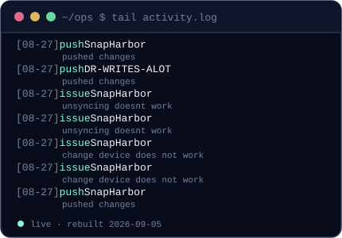
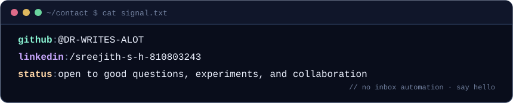

<!--
  Sreejith SH · profile console
  The visual panels are generated locally from scripts/build_profile.py.
  GitHub Actions rebuilds them from public profile data every six hours.
-->

  

  <code>builds useful things</code> &nbsp;·&nbsp; <code>learns in public</code> &nbsp;·&nbsp; <code>keeps a side quest open</code>

 

<!-- ───────────────── selected work ───────────────── -->

  

  

  

<!-- ───────────────── telemetry (live) ───────────────── -->

  
  &nbsp;
  

  

<!-- ───────────────── loadout / stack ───────────────── -->

<!-- ───────────────── whois / reach ───────────────── -->

  
  &nbsp;
  
  &nbsp;
  

  
<code>cat profile.md</code> · text-only index

  ### About

  I’m **Sreejith SH**, a Computer Science student at **VIT, class of 2029**, and an aspiring web developer. I learn by building desktop tools, web experiments, simulations, and small Unity mechanics.

  ### Current focus

  - **SnapHarbor:** a local-first Windows media vault with SHA-256 deduplication, device sync, timeline browsing, and automation.
  - **FLOW:** proactive journey recovery and deterministic transit simulations.
  - **Unity side quests:** game loops, physics, and C# experiments.

  ### Featured links

  - [SnapHarbor](https://github.com/DR-WRITES-ALOT/SnapHarbor)
  - [FLOW](https://github.com/DR-WRITES-ALOT/FLOW) · [live demo](https://flow-nexus-psi.vercel.app)
  - [Rapid Response Drone Mapper](https://github.com/DR-WRITES-ALOT/rapid-response-dronemapper) · [demo](https://rapid-response-dronemapper-5mfhmxho42ajqjsbn9appzm.streamlit.app/)
  - [All repositories](https://github.com/DR-WRITES-ALOT?tab=repositories)

 

  
    this readme builds itself. the console, dossier cards, activity feed, contribution scan, and hologram above are real — regenerated from public GitHub data by <a href=".github/workflows/profile.yml"><code>scripts/build_profile.py</code></a>. no third-party stats widgets. no template.
  

