  <!-- The Playful Hero Hook -->
  

    

  <!-- Dynamic Typing Tagline -->
  

    

  <!-- The Toybox (Tech Stack) -->
  

    

  <!-- The Lab (Projects) -->
  

    
  
  <!-- GitHub Stats & Activity -->
  <h2 align="center">📊 Activity Tracker</h2>
   
  
  <table border="0" align="center">
    <tr align="center">
      <td>
        
      </td>
      <td>
        
      </td>
    </tr>
  </table>

    

  <!-- Connect Station -->
  

