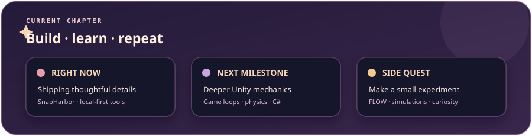
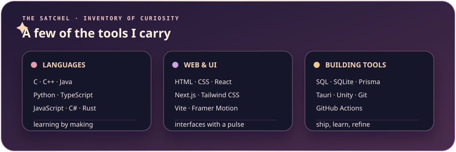
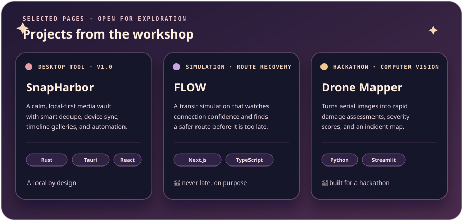

  

   

  

    
    
    
    
  

  
<em>Small ideas, carefully made, one chapter at a time.</em>

## ✦ About me

Hi, I’m **Sreejith SH** — a Computer Science student at **VIT, class of 2029**, and an aspiring web developer who likes turning curious ideas into useful little worlds.

I’m most at home somewhere between a clean interface and the systems that make it work. I enjoy learning by building: desktop tools, web experiments, simulations, and the occasional game mechanic just to see what happens.

  

### Current chapter

- ⚓ **Building:** SnapHarbor, a local-first media vault with smart deduplication, timeline browsing, and automation.
- 🧭 **Exploring:** proactive journey recovery and deterministic simulations through FLOW.
- 🎮 **Side quest:** Unity, game mechanics, and physics-driven experiments.
- ✍️ **Learning in public:** C, C++, Java, Python, web development, SQL, and the tools that help ideas become real.

> **A note from the margins:** this page is a living profile. The numbers and activity panels are refreshed automatically; the rest is the story behind the code.

## ✦ My satchel

  

<strong>Open the full inventory</strong>

| Chapter | Tools I use or am exploring |
| :--- | :--- |
| **Languages** | C · C++ · Java · Python · TypeScript · JavaScript · C# · Rust |
| **Web & UI** | HTML · CSS · React · Next.js · Tailwind CSS · Framer Motion |
| **Data & desktop** | SQL · SQLite · Prisma · Tauri |
| **World-building tools** | Unity · Git · GitHub Actions · Vite |

## ✦ Selected pages

  

<table>
  <tr>
    <td width="50%" valign="top">
      <h3>⚓ SnapHarbor</h3>
      
A high-performance, local-first photo and video vault for Windows. It brings together SHA-256 deduplication, a timeline gallery, device sync, automation rules, and a calm glassmorphism interface.

      
<strong>Built with:</strong> Tauri 2 · Rust · React 19 · TypeScript · SQLite

      <a href="https://github.com/DR-WRITES-ALOT/SnapHarbor">Read the SnapHarbor chapter →</a>
    </td>
    <td width="50%" valign="top">
      <h3>🧭 FLOW</h3>
      
A deterministic transit simulation that watches connection confidence, models disruption, and proactively finds a safer route before a journey falls apart.

      
<strong>Built with:</strong> Next.js · TypeScript · Tailwind CSS · Prisma

      <a href="https://github.com/DR-WRITES-ALOT/FLOW">Read the FLOW chapter →</a>
      · <a href="https://flow-nexus-psi.vercel.app">Visit the live demo →</a>
    </td>
  </tr>
  <tr>
    <td width="50%" valign="top">
      <h3>🚁 Rapid Response Drone Mapper</h3>
      
A hackathon experiment that uses Gemma 4 to analyse drone imagery, estimate disaster severity, extract GPS data, and turn a pile of images into an actionable incident map.

      
<strong>Built with:</strong> Python · Streamlit · Gemma 4 · Pandas

      <a href="https://github.com/DR-WRITES-ALOT/rapid-response-dronemapper">Read the mapper chapter →</a>
      · <a href="https://rapid-response-dronemapper-5mfhmxho42ajqjsbn9appzm.streamlit.app/">Open the demo →</a>
    </td>
    <td width="50%" valign="top">
      <h3>🎮 Unity side quests</h3>
      
Small experiments are where I practice game loops, physics, and C# mechanics. They may not all become repositories, but they keep the curiosity engine running.

      
<strong>Current spell:</strong> learn the mechanic, break the mechanic, understand the mechanic.

      <a href="https://github.com/DR-WRITES-ALOT?tab=repositories">Browse all repositories →</a>
    </td>
  </tr>
</table>

## ✦ Observatory

  

  
  

  

Telemetry is generated by GitHub Actions. External cards are optional snapshots of the same public profile.

## ✦ Send a signal

If you found something useful, have an idea, or simply want to talk about building things, I’d love to hear from you.

  
  
  

 

  
   
  Made with curiosity, midnight tabs, and an unreasonable fondness for tiny details.

