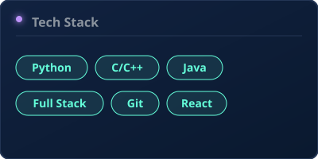

<!--
  Sreejith S H — profile readme
  The visuals are SVGs under assets/, generated dynamically by .github/workflows/profile-builder.yml
-->

  

 

<!-- ───────────────── telemetry (live) ───────────────── -->

  
  &nbsp;
  

 

<!-- ───────────────── whois / reach ───────────────── -->
<h3 align="center">Initialize Connection</h3>

  
  &nbsp;
  
  &nbsp;
  

 

  
  The terminal hero, stats dashboard, and skills badges above are auto-generated on a schedule by a GitHub Action (<a href=".github/workflows/profile-builder.yml"><code>.github/workflows/profile-builder.yml</code></a>) that renders its own SVGs in Python.
  

